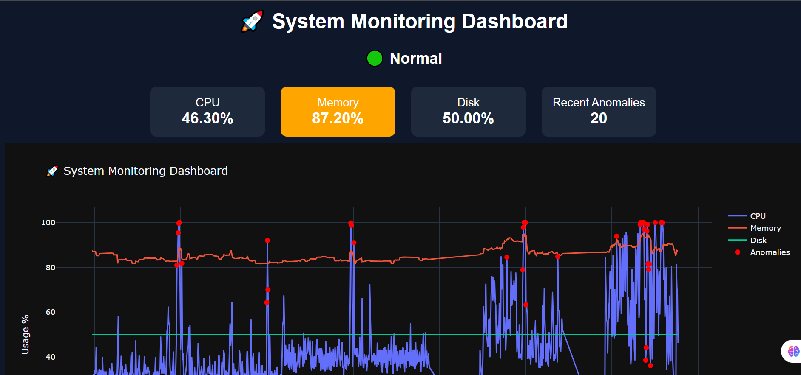

# 🚀 Real-Time System Monitoring & Anomaly Detection Dashboard

## 📌 Overview
This project is a real-time system monitoring platform built using Python that collects, processes, and analyzes system-level metrics such as CPU, memory, and disk usage. It integrates machine learning-based anomaly detection with an interactive web dashboard for visualization and monitoring.

The system simulates real-world monitoring environments used in large-scale computing infrastructures.

---

## ⚙️ Features
- 📊 Real-time monitoring of CPU, Memory, and Disk usage  
- 🔄 Continuous data collection using a streaming pipeline  
- 🤖 Anomaly detection using Isolation Forest (Machine Learning)  
- 📈 Interactive dashboard built with Flask and Plotly  
- 🔴 Visual anomaly highlighting on graphs  
- 🚨 Threshold-based system alerts (Normal / Warning / Critical)  
- ⚡ Auto-refresh dashboard for near real-time updates  

---

## 🏗️ System Architecture
1. **Data Collection Layer** → Collects system metrics using `psutil`  
2. **Data Processing Layer** → Stores and processes time-series data using `pandas`  
3. **ML Layer** → Detects anomalies using `IsolationForest`  
4. **Visualization Layer** → Displays insights using Flask + Plotly dashboard  

---

## Project Structure

```
system-monitor/
│── data_collector.py
│── anomaly_detector.py
│── dashboard.py
│── main.py
│── utils.py
│── requirements.txt
│── README.md
│── assets/
│   └── dashboard.png
│── README.md
```

---
---

## 🛠️ Tech Stack
- **Backend:** Python  
- **Data Processing:** Pandas, NumPy  
- **Machine Learning:** Scikit-learn  
- **Visualization:** Plotly  
- **Web Framework:** Flask  
- **Frontend:** HTML, CSS, JavaScript  
---
## Demo 

---

---
## ▶️ Installation & Setup

### 1. Clone Repository
```bash
git clone https://github.com/yourusername/system-monitor.git
cd system-monitor

2. Install Dependencies
pip install -r requirements.txt

3. Run Application
python main.py

4. Open Dashboard
http://127.0.0.1:5000
```bash
---
💡 Key Learnings
Designing real-time data pipelines
Implementing anomaly detection in streaming data
Building interactive dashboards for monitoring systems
Handling concurrent processes using multithreading in Python

🚀 Future Improvements
Deploy dashboard on cloud platforms (AWS / Render)
Add authentication and user management
Integrate database (PostgreSQL / Firebase)
Enhance anomaly detection using deep learning models

👨‍💻 Author
M. Sabda Pyari
Python Developer | Data & Systems Enthusiast

📄 License
This project is open-source and available under the MIT License.
